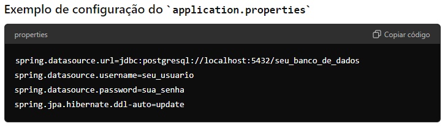
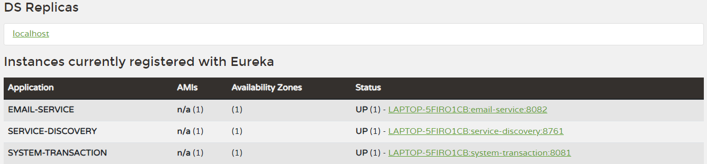
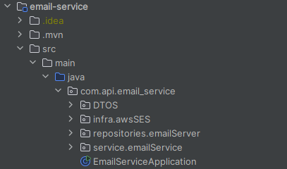
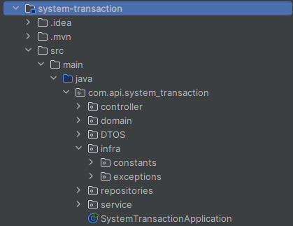

# Projeto Simulando um serviço de assinatura

Este projeto consiste em dois serviços principais: email-service e system-transaction, ambos conectados a um servidor Eureka para descoberta de serviços. O projeto utiliza Spring Boot, PostgreSQL, JPA, Java Email Sender, AmazonSES , Lombok e inclui testes unitários.

## Sobre o Projeto :

O usuario vai escolher um plano de assinatura , após isso , ele vai realizar a transação , será implementado metodos de validação nessa transação
se a transação ocorrer bem será enviado um e-mail utilizando os serviços citados acima , o usuario tambem vai ter a opção de entrar em contato com a empresa
no endpoint "/contact" , então vai ser enviado um e-mail informando que logo a empresa retornara.

## Estrutura do Projeto

- service-discovery: Serviço Eureka Server para descoberta de serviços.

- email-service: Serviço responsável por enviar e-mails.

- system-transaction: Serviço responsável por gerenciar transações do sistema.

- ## Pré-requisitos

- Java 11 ou superior

- Maven 3.6.3 ou superior

- PostgreSQL

- Docker (opcional, para facilitar a configuração do PostgreSQL)

## Configuração do PostgreSQL

- Instale e configure o PostgreSQL.
  
- Crie um banco de dados para o projeto.
  
- Atualize as configurações de conexão no application.properties de cada serviço.

## Estrutura do Eureka Server

## Estrutura do Serviço de email

## Estrutura do serviço de transação

## EndPoints

- "/product/create" - Metodo POST

Este endpoint tem como finalidade criar um produto.

- "/product/plans" - Metodo GET

Este endpoint tem como finalidade listar os produtos criados.

- "/user/create" - Metodo POST

Este endpoint tem como finalidade criar um usuario , é necessario atrelar um produto ao usuario.

- "/transaction/create" - Metodo Post

Este endpoint tem como finalidade realizar a transação do usuario.

- "/contact" - Metodo Post

Este endpoint tem como finalidade enviar um formulario de contato para empresa para tirar duvidas sobre o plano.

## Services

- Todo serviço de transação segue a seguinte logica , um usuario vai escolher um produto , então
ele vai preencher os campos do cartão de credito e vai ocorrer a verificação se a salda disponivel

- Se a transação for feita com sucesso é enviado um email para o usuario , parabenizando a escolha do plano.

## Tecnologias Utilizadas

- Spring Boot

- PostgreSQL

- JPA (Java Persistence API)

- Java Email Sender

- AmazonSES

- Lombok

- Testes Unitários (JUnit, Mockito)

- Eureka Server

## Contribuição

Contribuições são bem-vindas! Sinta-se à vontade para abrir issues e pull requests.

